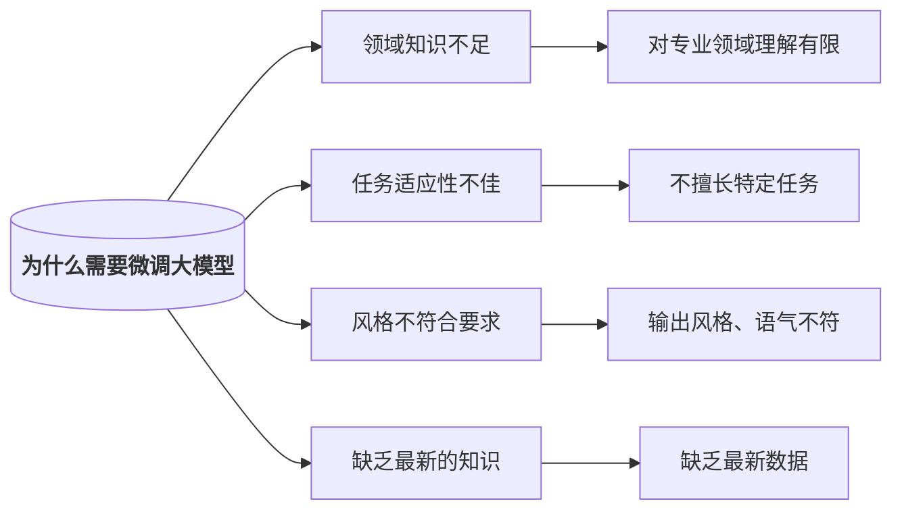

# Qwen3-0.6B微调行业大模型

## 1.参考资料
[【喂饭教程】30分钟学会Qwen3-14B微调行业大模型，环境配置+模型微调+模型部署+效果展示详细教程！草履虫都能学会~~~](https://www.bilibili.com/video/BV1SHEizUEoE)
## 2.使用在线资源
[Google colab](https://colab.research.google.com/)
# 为什么需要微调大模型

